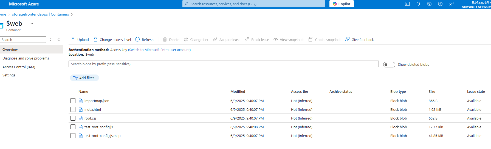
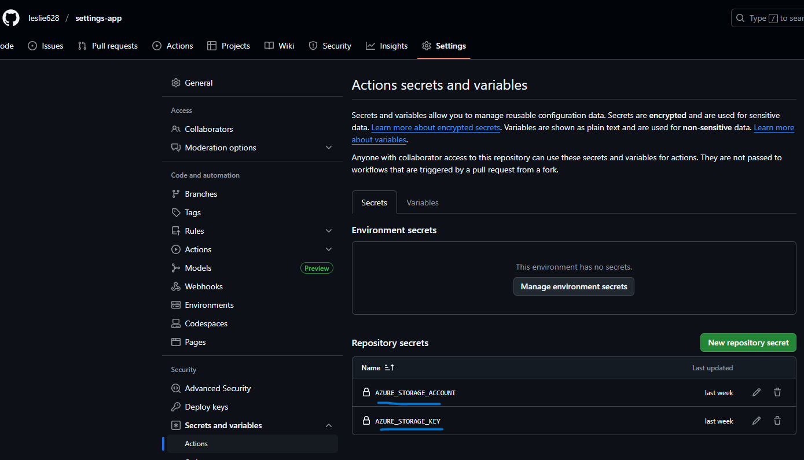
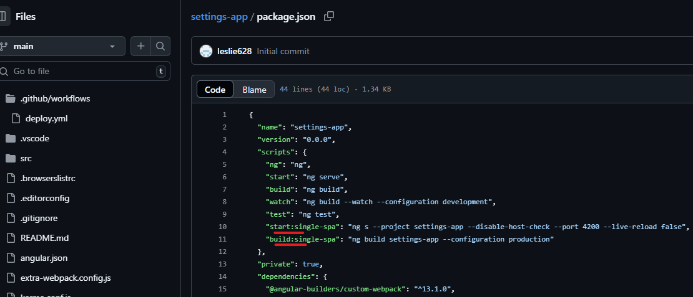
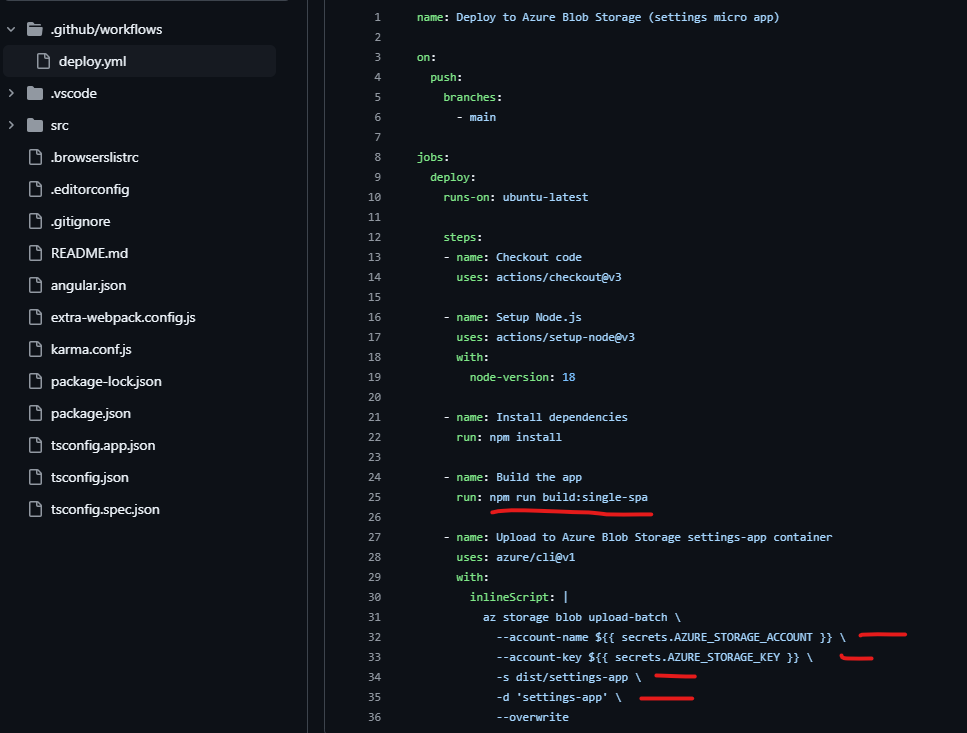
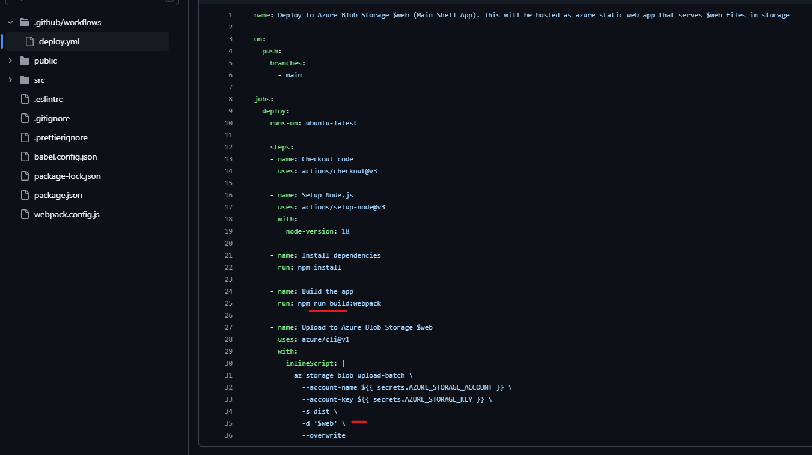
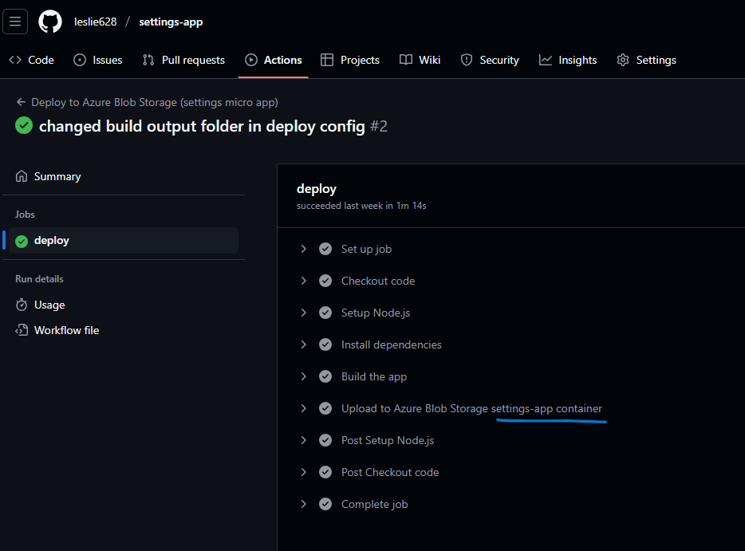
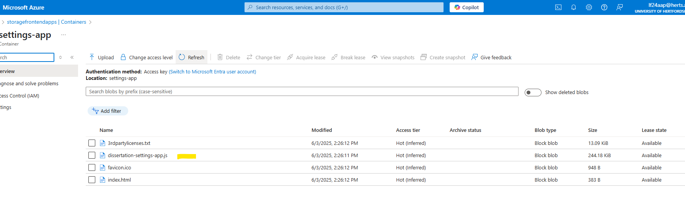

# Azure Deployment
## Azure storage displaying micro app containers. 

## Azure storage displaying shell App files. 

## Github secrets added for all micro apps using access keys from storage account.

## Package command to build micro apps for production.

## Micro app automated deploy actions config using the secrets.

## Shell app automated deploy actions config (hosted as static website $web).

## Deploy actions for micro app success.

## After Github actions deployed successfully using respective deploy.yml, files uploaded to azure storage respective container.

