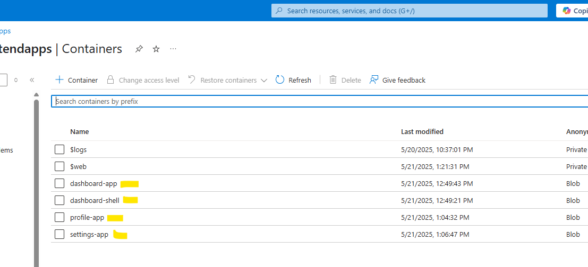
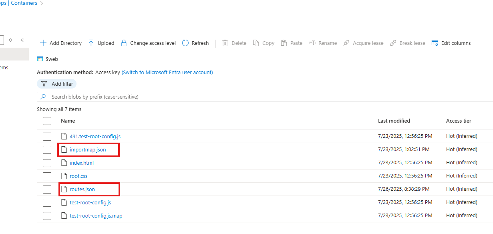

# Azure Deployment
## Azure storage displaying micro app containers. 

## Shell app azure pipeline.

## Azure storage displaying shell App files (hosted as static website $web). Routes.json and importmap.json are the configuration files for adding new micro apps 

## Azure pipeline variables added for all micro apps using access keys from storage account.

## Micro app azure pipeline.

## micro app deployment success.

## After azure pipeline run completed successfully, files uploaded to azure storage respective container.

